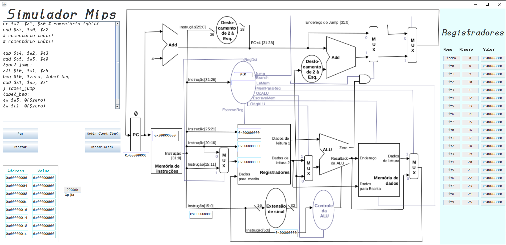
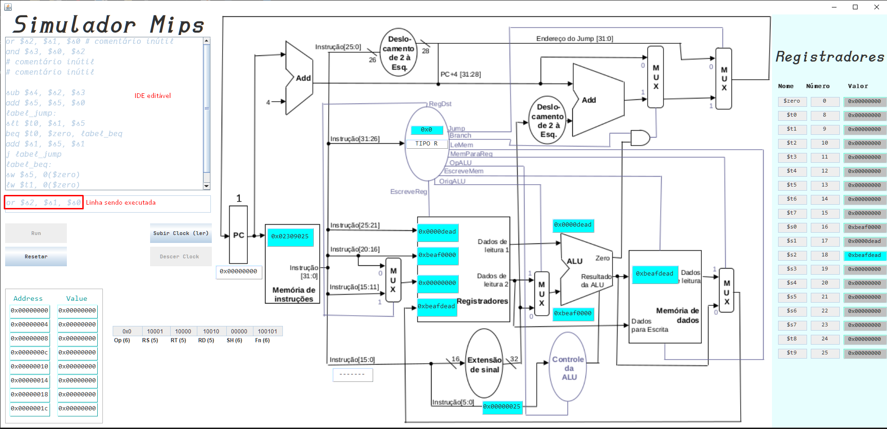
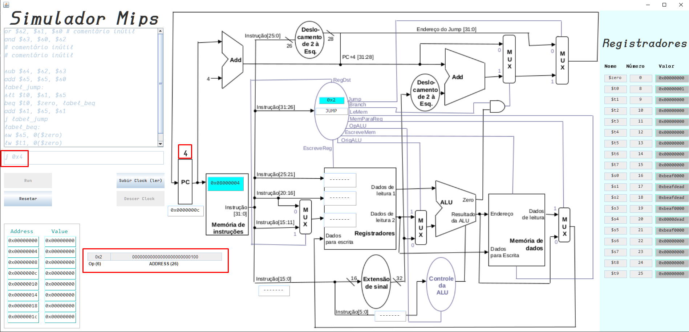
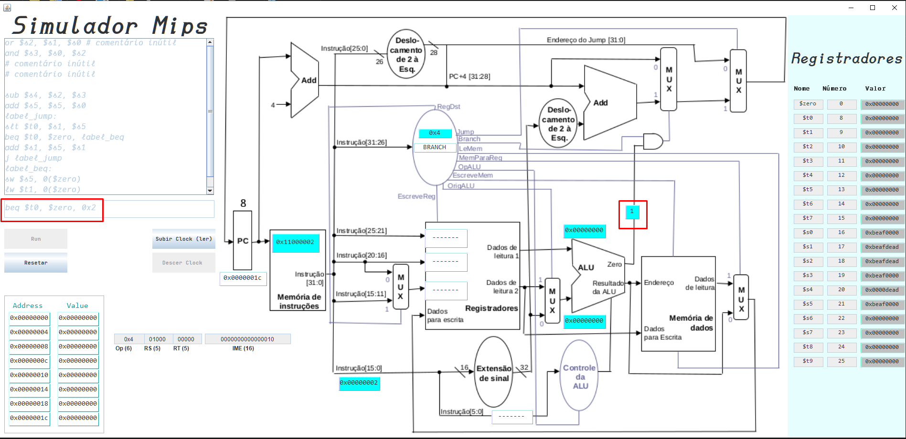
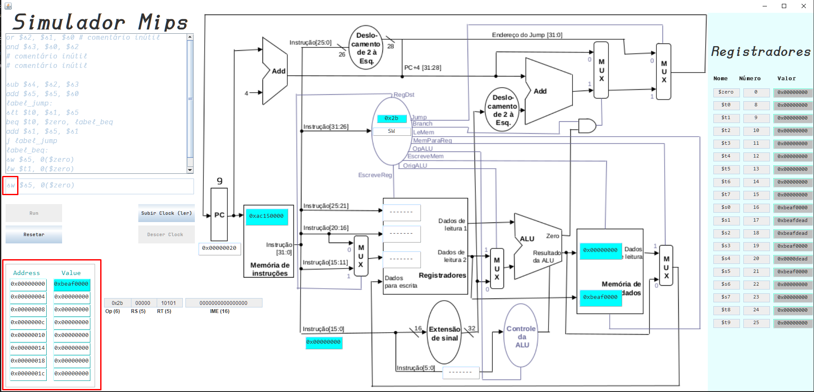

#  IDE - Simulador para o processador MIPS Single Clock

Versão JAR disponível para Download: <a href="https://github.com/igorlamoia/simulador-mips/releases/tag/1.0.0">Release</a> 

Vídeo apresentando projeto: https://youtu.be/uo8LttpzOj0

A resolução do monitor deve estar acima de 1600 x 900 para a Interface não "estourar"

---

 Projeto desenvolvido para disciplina de Organização de Computadores (CEFET - Leopoldina)

 

 <a href="#Considerações">Considerações</a>

# Imagens

### IDE de código editável

### OR (Tipo R) - em execução

### Instrução de JUMP

### Branch equal (beq)
- Para pular ou não linha de acordo com igualdade

### Armazenar valor na memória (sw)
-  Funcionando como um vetor, pega determinada memória e aloca um valor
### Já o lw faz o contrário do sw 
- Lê determinado valor da memória (acessando o vetor)

<a href="#Imagens">Imagens</a>
## Considerações:

1. O código da IDE pode e deve ser modificado, não suportamos operações de tipo imediado (ORI por exemplo)
2. Para setar os valores iniciais, fique à vontade para trocar o valor do Registrador que desejar antes de dar Run
3. Ao clicar em RUN toda interface será travada para que nenhum valor seja modificado
4. Toda linha é convertida para binário, e é evidenciada ao lado dos Endereços (Address), porém mostramos HEX nos visores para não estourar os valores (pelo fato de binários terem muitos bits)
5. Cada código binário corresponde a determinado registrador e na classe Registradores fazemos essa conversão, tanto de nome de Reg para bin, quanto de Bin para Reg
6. Lembre-se a ALU é responsável por realizar operações (OR, ADD, SUB, ...), então uma classe foi criada especialmente para isso
7. Não faça SUB com valores negativos
8. Utilize JDK 17+ de preferência
---
